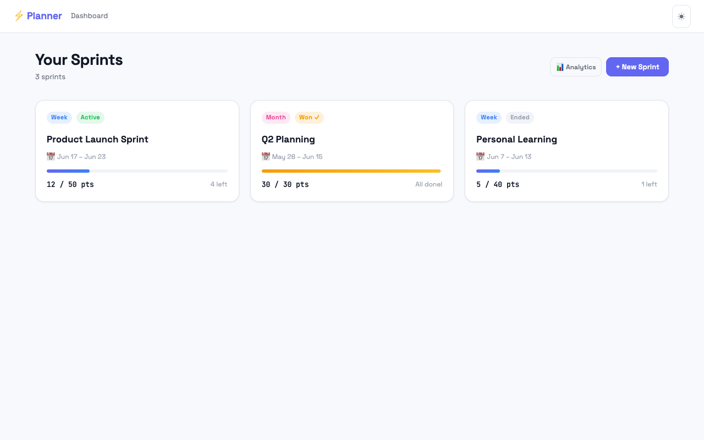
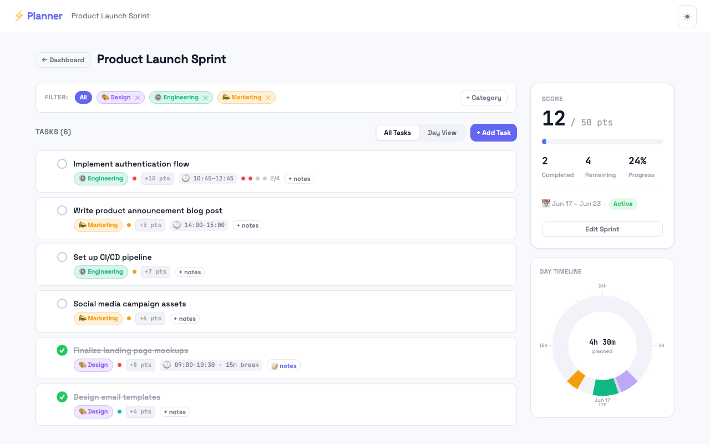
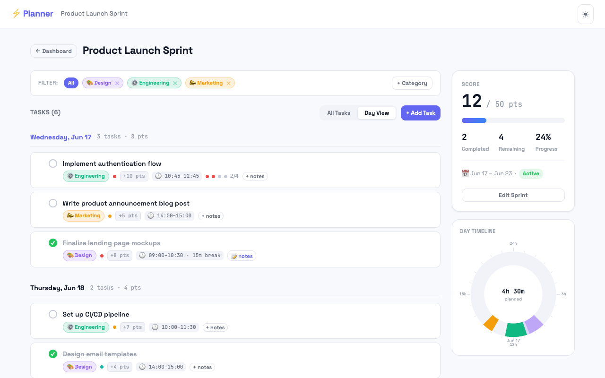
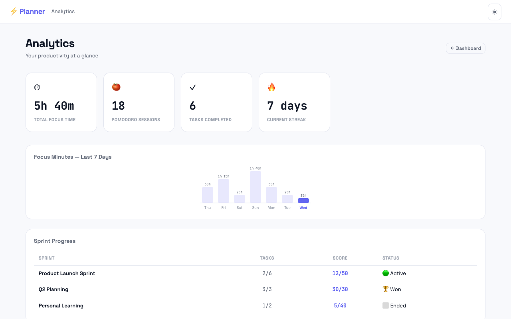
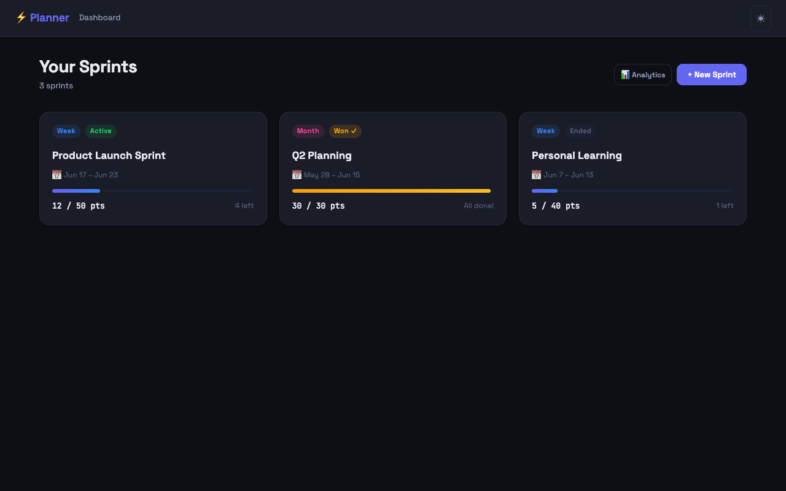

# ⚡ Smart Personal Planner

A sprint-based productivity planner with gamification, a Pomodoro timer, a day timeline, and analytics — all in a single static HTML file. No build step, no dependencies, no server.



---

## Features

### Sprint Management
Organize your work into focused sprints — daily, weekly, monthly, or custom. Set a target score to "win" a sprint and track progress at a glance.



- **4 sprint types:** Day, Week, Month, Custom
- **Score system:** assign point values to tasks; completing tasks builds your sprint score
- **Win condition:** hit the target score and trigger a confetti celebration
- **Status badges:** Active, Won, Ended

### Task Management
Rich tasks with categories, priorities, scheduling, and notes — drag to reorder.

- **Priority levels:** Low, Medium, High (color-coded)
- **Category chips:** custom emoji + color per category
- **Time scheduling:** assign a start time, duration, and optional break to each task
- **Markdown notes:** write and preview formatted notes per task
- **Drag-and-drop:** reorder tasks in both All Tasks and Day View

### Day View & Timeline
Switch to Day View to see tasks grouped by date with per-day scores. The circular 24-hour clock on the right visualizes your scheduled tasks as color-coded arcs.



### Pomodoro Timer
Built-in Pomodoro timer attached to individual tasks.

- Configurable sessions (1–12), focus duration, short and long breaks
- Floating widget stays visible while the timer runs
- Web Audio API beep on phase change; browser tab updates with countdown
- Desktop notifications for phase transitions
- Session progress dots shown directly on the task item

### Analytics
Track productivity trends across all your sprints.



- **Stat cards:** total focus time, Pomodoro sessions, tasks completed, current streak
- **7-day bar chart:** focus minutes per day, today highlighted
- **Sprint progress table:** task completion and score ratio for every sprint

### Gamification & Sprint Wins
Complete enough tasks to reach the target score and win the sprint — canvas confetti bursts, a victory badge appears on the card, and the progress bar turns gold.

### Light & Dark Mode
One-click theme toggle. All colors are CSS custom properties — the switch is instant.



---

## Getting Started

No install required. Just open the file:

```bash
open /path/to/Planner/index.html
```

Or drag `index.html` into any browser.

To reset all data:
```js
// Paste in browser DevTools console
localStorage.removeItem('planner-v1')
```

---

## Project Structure

```
index.html                  App shell (navbar, #app mount, modal portal, toast portal)
planning-table.html         Standalone weekly task tracker (separate tool)
css/
  tokens.css                All CSS variables — light/dark via html.dark class
  base.css                  Reset, body, typography, layout utilities
  components.css            Every UI component class
  animations.css            @keyframes only
js/
  store.js                  CRUD for sprints/tasks/categories + localStorage sync
  router.js                 Hash routing (#dashboard, #sprint/:id, #analytics)
  utils.js                  Pure helpers (escHtml, date formatting, etc.)
  confetti.js               Canvas particle burst on sprint win
  app.js                    Bootstrap + global event delegation (data-action)
  components/
    modal.js                Generic modal open/close/confirm
    toast.js                Ephemeral notifications
    sprintCard.js           Sprint card for dashboard grid
    taskItem.js             Single task row
    categoryChip.js         Colored category badge
  views/
    dashboard.js            Sprint grid + create/edit sprint modals
    sprintDetail.js         Task list, score panel, timeline, day view
    analytics.js            Stat cards, bar chart, sprint progress table
```

---

## Data Model

State is stored in `localStorage` under the key `planner-v1` and never read directly — always accessed through `Store`.

```jsonc
{
  "version": 2,
  "theme": "light" | "dark",
  "sprints": [
    {
      "id": "spr_<ts>_<rand>",
      "name": "Sprint name",
      "type": "day" | "week" | "month" | "custom",
      "startDate": "YYYY-MM-DD",
      "endDate": "YYYY-MM-DD",
      "targetScore": 50,
      "won": false,          // sticky — never reset to false once true
      "categories": [{ "id", "name", "color", "emoji" }],
      "tasks": [
        {
          "id": "tsk_<ts>_<rand>",
          "title": "Task title",
          "categoryId": "cat_id | null",
          "priority": "low" | "medium" | "high",
          "score": 5,
          "completed": false,
          "notes": "Markdown string",
          "dayDate": "YYYY-MM-DD | null",   // scheduled day
          "startTime": "HH:MM | null",
          "duration": 90,                   // minutes
          "breakAfter": 15,                 // minutes | null
          "pomodoro": {
            "sessions": 4,
            "focusMins": 25,
            "shortBreakMins": 5,
            "longBreakMins": 15,
            "completedSessions": 0
          } // null if not configured
        }
      ]
    }
  ],
  "analytics": {
    "totalFocusedMinutes": 0,
    "totalSessions": 0,
    "dailyLog": {
      "YYYY-MM-DD": { "focusedMinutes": 0, "completedSessions": 0, "completedTasks": 0, "score": 0 }
    }
  }
}
```

`currentScore` for a sprint is always computed at runtime via `Store.getSprintScore(id)` — never stored.

---

## Tech Stack

| Layer | Choice |
|---|---|
| Language | Vanilla JavaScript (ES6+), no framework |
| Styling | CSS custom properties, flexbox/grid |
| Routing | Hash-based (`#dashboard`, `#sprint/:id`) |
| Persistence | `localStorage` (key: `planner-v1`) |
| Timer audio | Web Audio API |
| Notifications | Notifications API |
| Confetti | `<canvas>` particle animation |
| Fonts | Space Grotesk · JetBrains Mono (Google Fonts) |
| Build tools | None |

---

## Architecture Notes

- **Event handling:** one global `click` listener in `app.js` dispatches via `data-action` attributes. Never add inline `onclick`.
- **UI updates:** always call `Router.renderCurrent()` after any `Store.*` mutation. Full re-render is intentional — no virtual DOM.
- **XSS safety:** all user-generated text goes through `Utils.escHtml()` before insertion into HTML template strings.
- **Script load order** (must be preserved): `utils.js → store.js → confetti.js → components/* → views/* → router.js → app.js`
